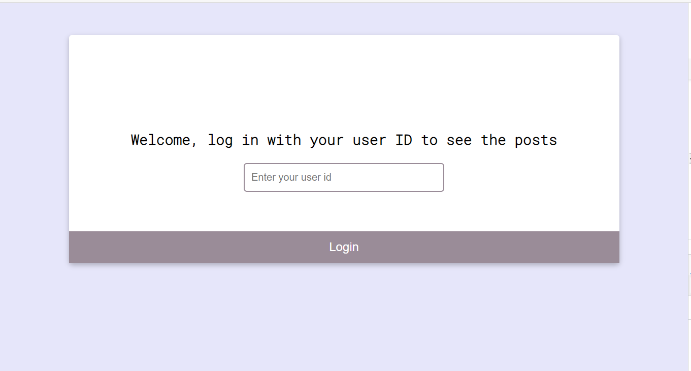
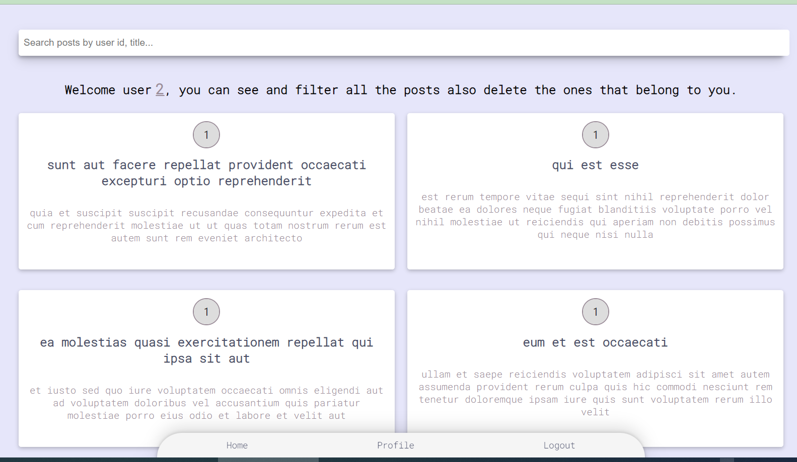
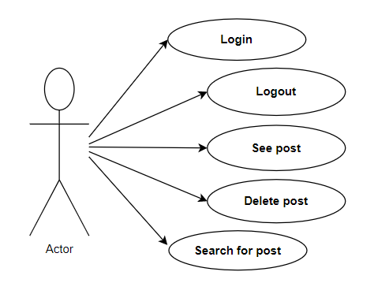
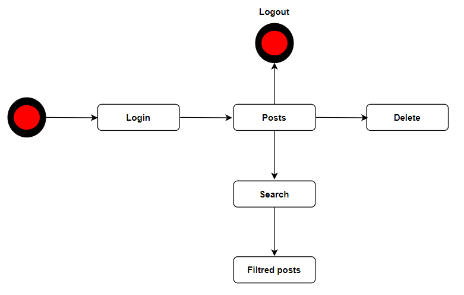

# Cleverpy

Technical test for Cleverpy.

Preview:
[deployed demo, made with love hope you like it!](https://deserted-wool.surge.sh/) 

## Funcional Description

- Login
- See Posts
- Delete Post
- Search by title/userId/body
- Infinit scroll - scroll down to render more items

##  Case Uses

##  WorkFlow

## Setup

In the project directory, you can run:

### `npm install && npm start`

Runs the app in the development mode.\
Open [http://localhost:3000](http://localhost:3000) to view it in the browser.

